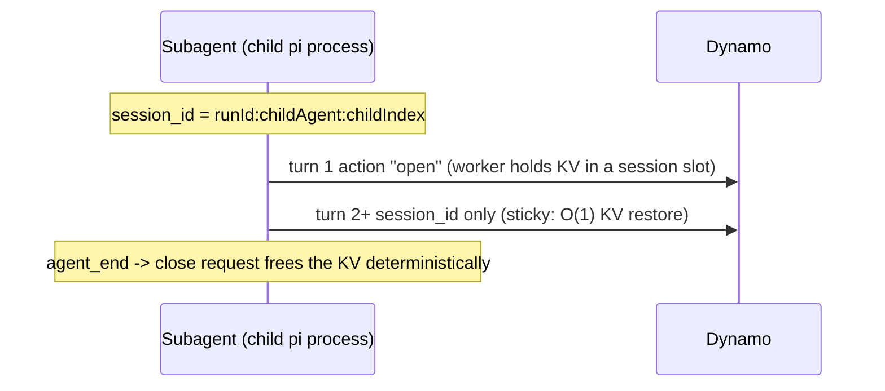

# pi-dynamo-provider

A Pi extension that registers a `dynamo` provider backed by [Dynamo](https://github.com/ai-dynamo/dynamo)'s OpenAI-compatible endpoint, so Pi can use Dynamo as a normal model:

```bash
pi --model dynamo/<model-id>
```

With one switch (`DYN_AGENT_TRACE=1`) it also tags every request for Dynamo's agent trace, gives each pi-subagent its own isolated KV session, and can relay Pi tool events into the trace — all without patching `pi-mono`.

## What it does

- **Model provider** — registers `dynamo`, discovers models from `/v1/models` (falls back to `dynamo/default`), and streams via Pi's OpenAI-compatible path.
- **Agent context** — injects `nvext.agent_context` (session/trajectory identity) so Dynamo can attribute each LLM request in its trace.
- **Subagent KV isolation** — gives each [pi-subagents](https://github.com/nicobailon/pi-subagents) child its own Dynamo streaming session: opened on its first turn, pinned across turns, and freed deterministically when the subagent finishes. See [Subagent KV isolation](#subagent-kv-isolation).
- **Tool-event relay** — optionally pushes Pi `tool_start` / `tool_end` / `tool_error` events to Dynamo over ZMQ so one trace shows LLM spans and tool spans together.

Everything but the bare model provider is gated by the `DYN_AGENT_TRACE` master switch and is off by default.

## Install

```bash
# From this repo
pi install git:git@github.com:ai-dynamo/pi-dynamo-provider.git

# Or from a local checkout (after `npm install && npm run build`)
pi install /absolute/path/to/pi-dynamo-provider

# Or try it for a single run, no install
pi -e ./src/index.ts --model dynamo/<model-id>
```

## Quick start

Point Pi at a running Dynamo endpoint:

```bash
export DYNAMO_BASE_URL=http://127.0.0.1:8000/v1
export DYNAMO_API_KEY=dummy        # local Dynamo usually ignores this; defaults to dynamo-local
export DYN_AGENT_TRACE=1           # opt into agent_context + subagent KV isolation

pi --model dynamo/<model-id> -p "Reply exactly ok."
```

That's the whole required setup. Everything else (`session_type_id`, `trajectory_id`, `session_id`, timeouts) has a sensible default and is only set when you want to override it — see [Configuration](#configuration).

## Subagent KV isolation

Agentic runs spawn short-lived subagents that accumulate KV cache, use it for a few turns, then exit. Left in the shared radix tree, that ephemeral KV competes with the lead agent's long-lived prefix for eviction. Dynamo's streaming sessions hold a subagent's KV in a dedicated slot — invisible to eviction, freed on close.

When `DYN_AGENT_TRACE=1` and this process is a pi-subagents child, the provider drives that lifecycle automatically via `nvext.session_control`:



- The session id is the subagent's own identity (`PI_SUBAGENT_RUN_ID:PI_SUBAGENT_CHILD_AGENT:PI_SUBAGENT_CHILD_INDEX`), so it needs no extra operator setup.
- The **lead agent is never pinned** — only subagents get a session, so primary requests stay load-balanced.
- Close fires on `agent_end` (with `session_shutdown` as a backstop). If neither lands, Dynamo's idle timeout reaps the session; tune it with `DYN_AGENT_SESSION_TIMEOUT`.

Requires a Dynamo frontend in `--router-mode kv` and an SGLang worker launched with `--enable-streaming-session` (SGLang ≥ 0.5.11). Against any other backend the `session_control` hint is ignored, so it is always safe to leave on.

> The provider also links parent/child **trajectory ids** for tracing when `DYN_AGENT_TRAJECTORY_ID` is set on the root. This is independent of KV isolation — see [Trajectory linking](#trajectory-linking).

## Configuration

The only thing you must set is the connection (`DYNAMO_BASE_URL`) and, to enable the agentic features, `DYN_AGENT_TRACE`. Everything below is an optional override.

| Variable | Default | Purpose |
| --- | --- | --- |
| `DYNAMO_BASE_URL` | `http://127.0.0.1:8000/v1` | Dynamo endpoint root (falls back to `OPENAI_BASE_URL`). |
| `DYNAMO_API_KEY` | `dynamo-local` | Bearer token. |
| `DYN_AGENT_TRACE` | off | **Master switch.** When truthy (`1`/`true`/`yes`/`on`), enables `agent_context`, subagent session_control, and the tool relay. |
| `DYN_AGENT_SESSION_TYPE_ID` | `pi_coding_agent` | Session class in the trace. |
| `DYN_AGENT_SESSION_ID` | Pi session id | Top-level run id. |
| `DYN_AGENT_TRAJECTORY_ID` | Pi session id | Trajectory id; also enables parent/child [trajectory linking](#trajectory-linking) for subagents. |
| `DYN_AGENT_PARENT_TRAJECTORY_ID` | unset | Parent trajectory; set manually to override the bridge. |
| `DYN_AGENT_SESSION_TIMEOUT` | Dynamo default (300s) | Idle timeout (seconds) sent on a subagent session open. |
| `DYN_AGENT_TOOL_EVENTS_ZMQ_ENDPOINT` | unset | Dynamo-bound ZMQ PULL endpoint for the tool relay (aliases: `DYN_AGENT_TRACE_TOOL_ZMQ_ENDPOINT`, `DYN_AGENT_TRACE_TOOL_EVENTS_ZMQ_ENDPOINT`). |

`PI_SUBAGENT_CHILD` / `PI_SUBAGENT_RUN_ID` / `PI_SUBAGENT_CHILD_AGENT` / `PI_SUBAGENT_CHILD_INDEX` are **read, never set** — pi-subagents populates them and the provider uses them to derive the subagent session id and trajectory link.

<details>
<summary>Injected request metadata</summary>

With `DYN_AGENT_TRACE` on, each request payload gets:

```json
{
  "nvext": {
    "agent_context": {
      "session_type_id": "pi_coding_agent",
      "session_id": "<pi-session-id>",
      "trajectory_id": "<pi-session-id>",
      "phase": "reasoning"
    },
    "session_control": { "session_id": "run-1:researcher:0", "action": "open" }
  }
}
```

`session_control` appears only for pi-subagents children. Existing `nvext` fields are preserved, and `x-request-id` is added when absent.
</details>

<details>
<summary>Tool-event wire format</summary>

When a tool-event endpoint is set, Pi connects a ZMQ PUSH socket and sends one multipart message per event:

```text
[topic, seq_be_u64, msgpack(AgentTraceRecord)]
```

The record uses Dynamo's `dynamo.agent.trace.v1` schema (`event_type`, `agent_context`, and a `tool` object with timing/status). Dynamo owns the PULL bind side, so multiple Pi processes and subagents can all connect as producers. Terminal `tool_end` / `tool_error` records are self-contained.
</details>

## Trajectory linking

For tracing (not KV isolation), the provider keeps parent and child trajectory ids distinct. When a pi-subagents child inherits the parent's `DYN_AGENT_TRAJECTORY_ID`, the provider reinterprets it as the child's `parent_trajectory_id` and synthesizes a fresh child `trajectory_id` (`runId:childAgent:childIndex`), mutating `process.env` so nested chains stay attributable. Setting `DYN_AGENT_PARENT_TRAJECTORY_ID` manually disables this. If you don't set `DYN_AGENT_TRAJECTORY_ID` at all, every agent simply uses its own Pi session id and the trace still works — only the explicit parent→child link is absent.

## Local Dynamo

Two helper scripts onboard a local Dynamo for testing:

```bash
./scripts/install-dynamo.sh    # clone + build Dynamo into a cache dir via uv + maturin
./scripts/launch-agg-agent.sh  # serve GLM-4.7-Flash: one frontend + one SGLang worker
```

`launch-agg-agent.sh` uses file discovery + TCP + ZMQ (no NATS/etcd), enables streaming sessions and JSONL tracing, and prints the exact Pi env to use. Common overrides:

```bash
./scripts/launch-agg-agent.sh --gpu 1            # different single GPU
./scripts/launch-agg-agent.sh --gpu 0,1 --tp 2   # one worker across two GPUs
./scripts/launch-agg-agent.sh -- --disable-cuda-graph   # forward flags to dynamo.sglang
```

> Subagent KV isolation additionally needs `--router-mode kv` on the frontend (which requires a NATS event plane). The default launcher is the no-NATS tracing setup; switch the event plane to `nats` and add `--router-mode kv` to exercise session_control end to end.

## Development

```bash
npm install
npm run check   # tsc --noEmit (strict)
npm run test    # vitest
npm run build   # -> dist/
```

`scripts/integration-smoke.sh` boots Dynamo's frontend + mocker and asserts the `nvext` envelope round-trips into the trace; it is the out-of-band end-to-end check.

## Troubleshooting

- **`/v1/models` empty** — wait for the backend to load; confirm frontend and worker share the same discovery/request/event planes and `DYN_FILE_KV`.
- **Model unknown** — `curl "$DYNAMO_BASE_URL/models"` and use the returned id as `dynamo/<id>`; restart Pi if discovery failed before Dynamo was ready.
- **No agent_context / 400 on requests** — make sure `DYN_AGENT_TRACE` is set; the provider injects nothing without it.
- **Tool spans missing** — set a tool-event endpoint on both sides and confirm the run actually used tools.
- **No subagent sessions** — needs `DYN_AGENT_TRACE=1`, a pi-subagents child (`PI_SUBAGENT_*` populated), `--router-mode kv`, and a worker with `--enable-streaming-session`.

## Scope

No `pi-mono` core changes, no native Rust ABI, no Dynamo launch management beyond the helper scripts. The `nvext` and `agent_trace.v1` schemas are owned upstream by Dynamo.
