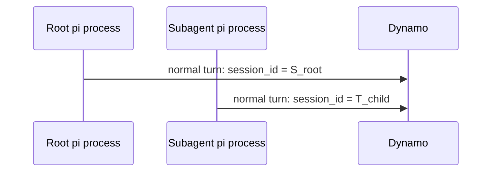

# pi-dynamo-provider

A Pi extension that registers a `dynamo` provider backed by [Dynamo](https://github.com/ai-dynamo/dynamo)'s OpenAI-compatible endpoint, so Pi can use Dynamo as a normal model:

```bash
pi --model dynamo/<model-id>
```

With one switch (`DYN_REQUEST_TRACE=1`) it also tags requests through Pi's native `session_id` header, gives each pi-subagent its own provider session id, and can relay Pi tool events into the trace — all without patching `pi-mono`.

## What it does

- **Model provider** — registers `dynamo`, discovers models from `/v1/models` (falls back to `dynamo/default`), and streams via Pi's OpenAI-compatible path.
- **Session header tracing** — enables Pi's OpenAI-compatible `session_id` affinity header so Dynamo can attribute each LLM request in its trace.
- **Subagent trajectory ids** — gives each [pi-subagents](https://github.com/nicobailon/pi-subagents) child its own provider session id. See [Subagent trajectory ids](#subagent-trajectory-ids).
- **Tool-event relay** — optionally pushes Pi `tool_start` / `tool_end` / `tool_error` events to Dynamo over ZMQ so one trace shows LLM spans and tool spans together.

Everything but the bare model provider is gated by the `DYN_REQUEST_TRACE` master switch and is off by default.

## Install

```bash
# From this repo
pi install git:git@github.com:ai-dynamo/pi-dynamo-provider.git

# Or from a local checkout (after `npm install && npm run build`)
pi install /absolute/path/to/pi-dynamo-provider

# Or try it for a single run, no install
pi -e ./src/index.ts --model dynamo/<model-id>
```

## Quick start

Point Pi at a running Dynamo endpoint:

```bash
export DYNAMO_BASE_URL=http://127.0.0.1:8000/v1
export DYNAMO_API_KEY=dummy        # local Dynamo usually ignores this; defaults to dynamo-local
export DYN_REQUEST_TRACE=1         # opt into session_id tracing + optional tool relay

pi --model dynamo/<model-id> -p "Reply exactly ok."
```

That's the whole required setup. Everything else is only set when you want to override it — see [Configuration](#configuration).

## Subagent trajectory ids

When `DYN_REQUEST_TRACE=1`, the provider relies on Pi's normal `sessionId` plumbing. Pi's OpenAI-compatible path sends that as the `session_id` header, and Dynamo maps it to request-trace `agent_context.session_id` and `agent_context.trajectory_id`.



- The root `trajectory_id` is Pi's own `sessionId`.
- The child `trajectory_id` is the subagent's own identity (`PI_SUBAGENT_RUN_ID:PI_SUBAGENT_CHILD_AGENT:PI_SUBAGENT_CHILD_INDEX`), so it needs no extra operator setup.
- The provider passes that value as the provider `sessionId`; Pi sends it as the `session_id` header.
- There is no provider-side `trajectory_final` close ping in this path.

> ZMQ tool records can include parent/child **trajectory ids** when `DYN_AGENT_TRAJECTORY_ID` is set on the root. See [Trajectory linking](#trajectory-linking).

## Configuration

The only thing you must set is the connection (`DYNAMO_BASE_URL`) and, to enable the agentic features, `DYN_REQUEST_TRACE`. Everything below is an optional override.

| Variable | Default | Purpose |
| --- | --- | --- |
| `DYNAMO_BASE_URL` | `http://127.0.0.1:8000/v1` | Dynamo endpoint root (falls back to `OPENAI_BASE_URL`). |
| `DYNAMO_API_KEY` | `dynamo-local` | Bearer token. |
| `DYN_REQUEST_TRACE` | off | **Master switch.** When truthy (`1`/`true`/`yes`/`on`), enables `session_id` tracing and the tool relay. |
| `DYN_AGENT_SESSION_TYPE_ID` | `pi_coding_agent` | Session class on ZMQ tool trace records. |
| `DYN_AGENT_SESSION_ID` | unset | Optional top-level run id on ZMQ tool trace records. |
| `DYN_AGENT_TRAJECTORY_ID` | unset | Optional parent trajectory seed for [trajectory linking](#trajectory-linking) in subagents. |
| `DYN_AGENT_PARENT_TRAJECTORY_ID` | unset | Parent trajectory; set manually to override the bridge. |
| `DYN_REQUEST_TRACE_TOOL_EVENTS_ZMQ_ENDPOINT` | unset | Dynamo-bound ZMQ PULL endpoint for the tool relay. |

`PI_SUBAGENT_CHILD` / `PI_SUBAGENT_RUN_ID` / `PI_SUBAGENT_CHILD_AGENT` / `PI_SUBAGENT_CHILD_INDEX` are **read, never set** — pi-subagents populates them and the provider uses them to derive the child `trajectory_id` and parent link.

With `DYN_REQUEST_TRACE` on, the provider does not mutate request payloads. It enables Pi's `session_id` affinity header and adds `x-request-id` when absent.

<details>
<summary>Tool-event wire format</summary>

When a tool-event endpoint is set, Pi connects a ZMQ PUSH socket and sends one multipart message per event:

```text
[topic, seq_be_u64, msgpack(RequestTraceRecord)]
```

The record uses Dynamo's `dynamo.request.trace.v1` schema (`event_type`, `event_source`, `agent_context`, and a `tool` object with timing/status). Dynamo owns the PULL bind side, so multiple Pi processes and subagents can all connect as producers. Terminal `tool_end` / `tool_error` records are self-contained.
</details>

## Trajectory linking

The provider keeps parent and child trajectory ids distinct for ZMQ tool records. When a pi-subagents child inherits the parent's `DYN_AGENT_TRAJECTORY_ID`, the provider reinterprets it as the child's `parent_trajectory_id` and synthesizes a fresh child `trajectory_id` (`runId:childAgent:childIndex`), mutating `process.env` so nested chains stay attributable. Setting `DYN_AGENT_PARENT_TRAJECTORY_ID` manually overrides the parent link. If you don't set `DYN_AGENT_TRAJECTORY_ID` at all, every subagent still gets its own child trajectory id — only the explicit parent-to-child link is absent.

## Local Dynamo

Two helper scripts onboard a local Dynamo for testing:

```bash
./scripts/install-dynamo.sh    # clone + build Dynamo into a cache dir via uv + maturin
./scripts/launch-agg-agent.sh  # serve GLM-4.7-Flash: one frontend + one SGLang worker
```

`launch-agg-agent.sh` uses file discovery + TCP + ZMQ (no NATS/etcd), enables JSONL tracing, and prints the exact Pi env to use. Common overrides:

```bash
./scripts/launch-agg-agent.sh --gpu 1            # different single GPU
./scripts/launch-agg-agent.sh --gpu 0,1 --tp 2   # one worker across two GPUs
./scripts/launch-agg-agent.sh -- --disable-cuda-graph   # forward flags to dynamo.sglang
```

## Development

```bash
npm install
npm run check   # tsc --noEmit (strict)
npm run test    # vitest
npm run build   # -> dist/
```

`scripts/integration-smoke.sh` boots Dynamo's frontend + mocker and asserts the `session_id` header round-trips into the trace; it is the out-of-band end-to-end check.

## Troubleshooting

- **`/v1/models` empty** — wait for the backend to load; confirm frontend and worker share the same discovery/request/event planes and `DYN_FILE_KV`.
- **Model unknown** — `curl "$DYNAMO_BASE_URL/models"` and use the returned id as `dynamo/<id>`; restart Pi if discovery failed before Dynamo was ready.
- **No agent_context in trace rows** — make sure `DYN_REQUEST_TRACE` is set and Dynamo is new enough to map `session_id`.
- **Tool spans missing** — set a tool-event endpoint on both sides and confirm the run actually used tools.

## Scope

No `pi-mono` core changes, no native Rust ABI, no Dynamo launch management beyond the helper scripts. The `nvext` and `request.trace.v1` schemas are owned upstream by Dynamo.
